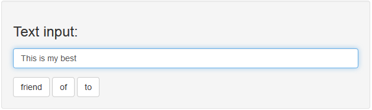
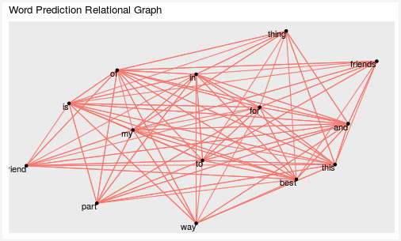

Coursera/JHU Data Science Specialization Capstone Project
========================================================
author: Aaron Trask
date: 11/29/2017
autosize: true

Word Prediction Application
========================================================

- Provides three word suggestions to complete the typed phrase
- Updates suggestions while typing
- Suggestions are clickable to add to typed phrase

[go to shiny app](https://ajtrask.shinyapps.io/WordPrediction/)

Usage
========================================================

**Step 1:** Type text into the input box

**Step 2:** Select a word suggestion that appears underneath or keep typing

***
**Note:** As you type the graph will update to show relationships of all words involved in the prediction

Algorithm
========================================================

- Up to 4-Gram Word Prediction Model
- Stupid Back-off Smoothing to Improve Prediction Performance [[ref]](http://www.aclweb.org/anthology/D07-1090.pdf)
- Trained on English Language Sample from Blogs, Twitter, and News Articles
- Training Results Adjustable for Memory Limitations through Sample Size and Pruning (Deployed model is 3.3 MB using 5% of the training data)

All source code available on GitHub [here](https://github.com/ajtrask/dSciCapstoneSwiftKeyCoursera).

Dependencies and Future Work
========================================================

**These libraries are required by the shiny app:**
- *stringr*, *tidyverse*, and *tidytext* for coercing input text for prediction
- *data.table* for the model data
- *igraph* and *ggraph* for graph display

**Next steps:**
- improve storage efficiency through an exploration of various hashing schemes
- distribute training step for faster and larger training runs
- create a model update procedure based on input text not seen in training
